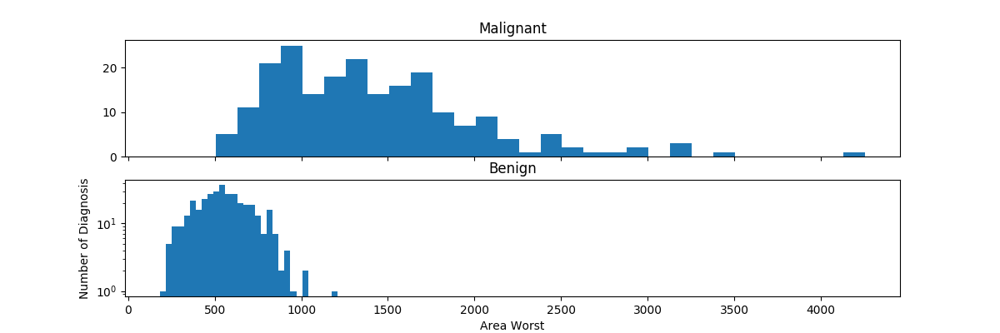

# Using Machine Learning to Predict Cancer in Mammograms
An experiment with the use of TensorFlow used for predicting whether a tumor sample is benign or metastasized.

## Area_Mean
The below graph shows the distribution of sample data comparing the area_mean across malignant and benign diagnosis.

The graph suggests that benign diagnosis have a normal distribution whereas malignant diagnosis are more uniformly distributed.

Given the distribution of malignant samples, the graph suggests that detection would be easier since the majority of samples exists above the 500 mark. 

## Diagnosis_Worst
The graph below shows the distribution of sample data comparing the diagnosis_worst label across malignant and benign diagnosis.

There exist some similarities between this representation as well as the area_mean graph above.

## Other Features
The graph below demonstrates the comparison of all the remaining features of the dataset.

## Results
The below graph demonstrates the prediction accuracy and cost after training the network. Results are recorded once every 10 epochs.

